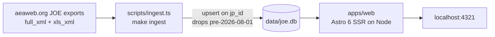

# joe-tracker v2 — Local setup

A local JOE (Job Openings for Economists) tracker: Astro SSR on Node, SQLite for
persistence, and a `make ingest` command that pulls JOE listings idempotently.

Primary user: a single person who wants to browse the current season's listings
(August 2026 onward), filter them, and mark each one **Interested** / **Not interested**.

---

## Confirmed decisions

- **Location:** `~/Documents/joe-tracker-v2`
- **Auth:** none — local-only, no login
- **History:** August 2026 season to present only (no 2015–2025 backfill)
- **Hosting:** local SQLite + local Node; no Cloudflare

---

## Architecture



```
joe-tracker-v2/
  apps/web/                   # Astro 6, output: "server", @astrojs/node
  packages/db/                # Drizzle schema, migrations, repos (better-sqlite3)
  packages/core/              # XML/XLSX parsers, academic-week math, SEASON_START
  scripts/{migrate,ingest,dev}.ts|.sh
  data/joe.db                 # local SQLite (gitignored)
```

---

## Ingest

`make ingest` fetches:

- `GET https://www.aeaweb.org/joe/resultset_output.php?mode=full_xml`
- `GET https://www.aeaweb.org/joe/resultset_xls_output.php?mode=xls_xml`

Merges on `jp_id` (XML for structured content, XLSX for `date_active`), skips anything
before `SEASON_START` (`2026-08-01`), and upserts via `packages/db`. ETag is stored in
the `meta` table so unchanged upstream responses are a no-op.

---

## Web app

Pages: `/` (all listings), `/interested`, `/not-interested`, `/charts`.

Filters via URL search params. Marks via Astro Actions. Charts are a single-season
cumulative + rolling-4-week view with slice selectors (finance, Fed, region, job type).

---

## Commands

```bash
pnpm install
make reset && make ingest && make dev
```
